# 📘 Documentació del Projecte — Metodologia Git Flow

## 🎯 Objectiu del projecte
Aquest projecte té com a finalitat implementar una pàgina web educativa per mostrar exemples d'interacció entre **JavaScript i HTML/CSS**, seguint una **metodologia professional de treball en equip amb Git Flow**.

---

## 🧠 Introducció a Git i Git Flow

### 🔹 Què és Git?
Git és un sistema de control de versions distribuït que permet gestionar l'evolució del codi font i col·laborar entre diversos programadors sense perdre l'historial de canvis.

### 🔹 Què és Git Flow?
Git Flow és una metodologia de treball basada en **branques estructurades**, ideal per equips. Utilitza diferents tipus d’extensions de branques:

| Tipus de branca | Propòsit |
|-----------------|---------|
| `main` / `master` | Versió estable en producció |
| `develop` | Zona de desenvolupament actiu |
| `feature/*` | Desenvolupament de funcionalitats |
| `release/*` | Preparació d'una versió oficial |
| `hotfix/*` | Correccions urgents sobre producció |

---

## 👥 Assignació de rols

| Usuari | Rol | Branques treballades |
|--------|-----|---------------------|
| Usuari 1 | Expert, setup i hotfix | `feature/estructura_inicial`, `hotfix/milloresV_1_0` |
| Usuari 2 | Desenvolupament HTML | `feature/contingutHTML`, `feature/atributsHTML` |
| Usuari 3 | CSS i release | `feature/estilsCSS`, `release/v1.0` |

---

## 📷 Procés Git Flow amb Captures

### 1️⃣ Clonar repositori
```bash
git clone https://github.com/voromb/practica_desplegament.git
```
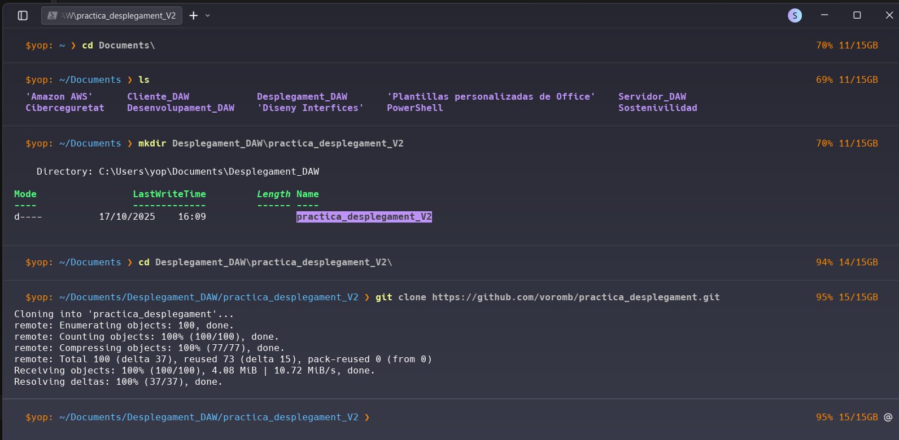

### 2️⃣ Inicialitzar Git Flow
```bash
git flow init
```
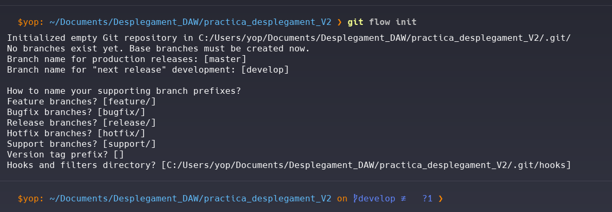

### 3️⃣ Crear estructura del projecte
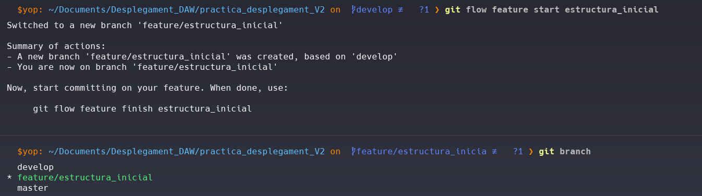

### 4️⃣ Primer commit assegurant estructura
```bash
git add .
git commit -m "feat(estructura): estructura inicial del projecte"
```
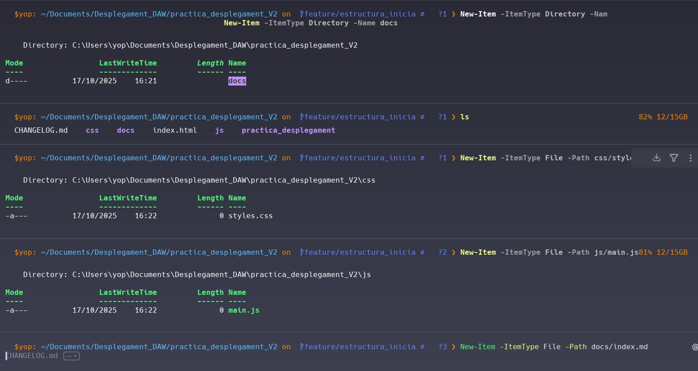

### 5️⃣ Tancar feature estructura_inicial
```bash
git flow feature finish estructura_inicial
```
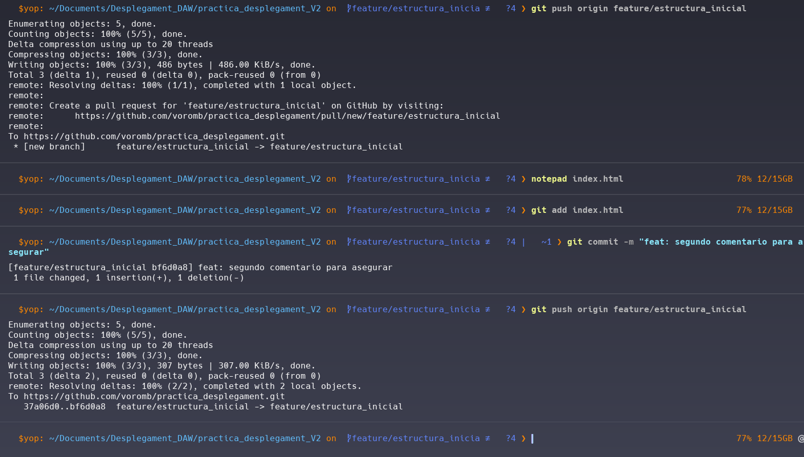

### 6️⃣ Crear feature contingutHTML
```bash
git flow feature start contingutHTML
```
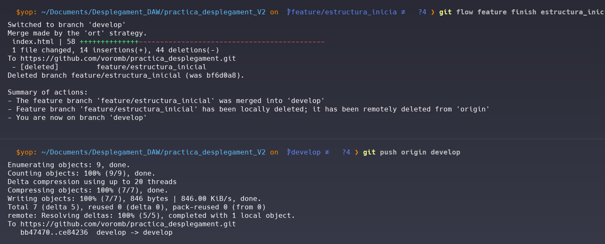

### 7️⃣ Commit de contingutHTML
```bash
git commit -m "feat(contingutHTML): afegir exemple d'interacció HTML"
```
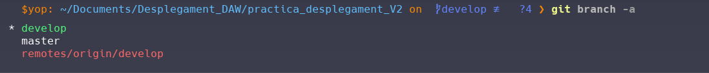

### 8️⃣ Finalitzar feature contingutHTML
```bash
git flow feature finish contingutHTML
```
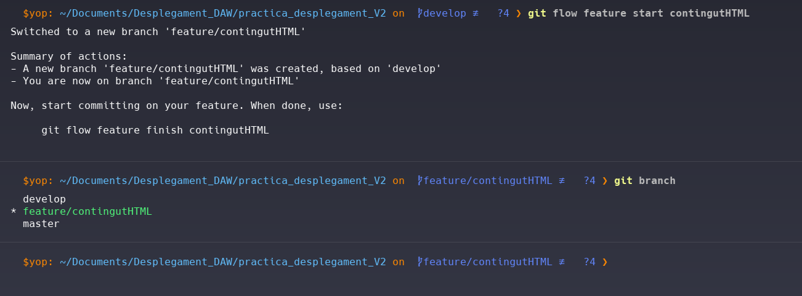

### 9️⃣ Crear feature atributsHTML
```bash
git flow feature start atributsHTML
```
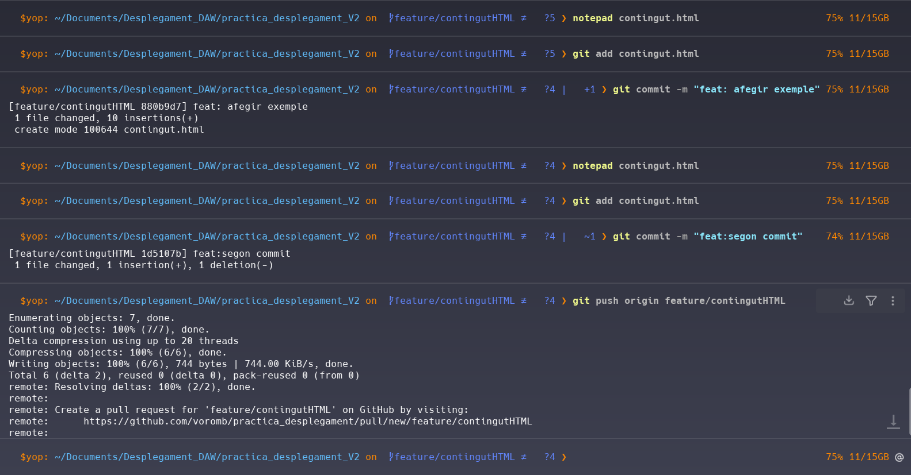

### 🔟 Commit atributsHTML
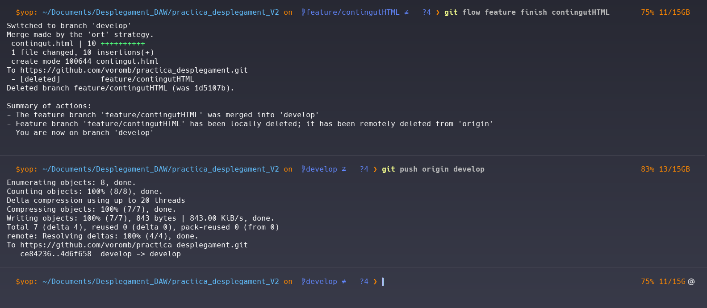

### 1️⃣1️⃣ Finalitzar feature atributsHTML
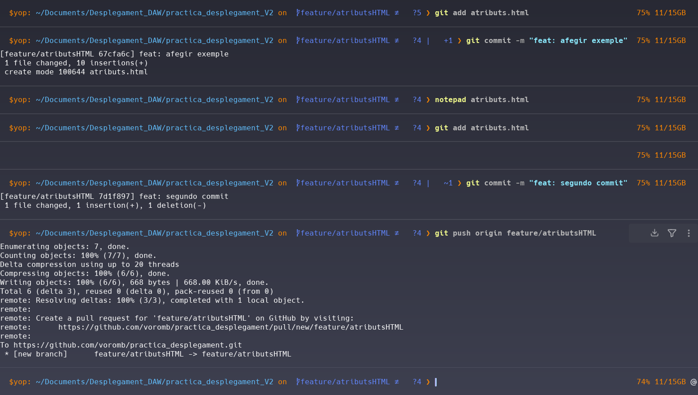

### 1️⃣2️⃣ Crear feature estilsCSS
```bash
git flow feature start estilsCSS
```
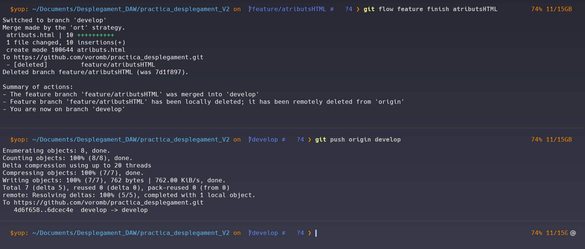

### 1️⃣3️⃣ Commit estilsCSS
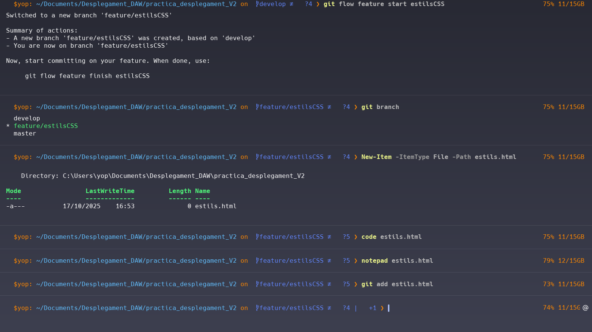

### 1️⃣4️⃣ Finalitzar feature estilsCSS
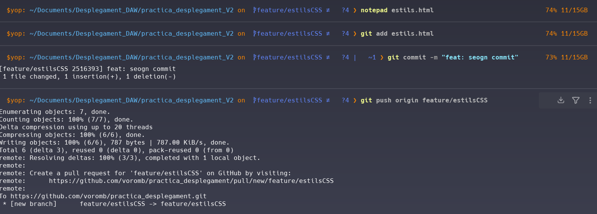

### 1️⃣5️⃣ Iniciar release v1.0
```bash
git flow release start v1.0
```
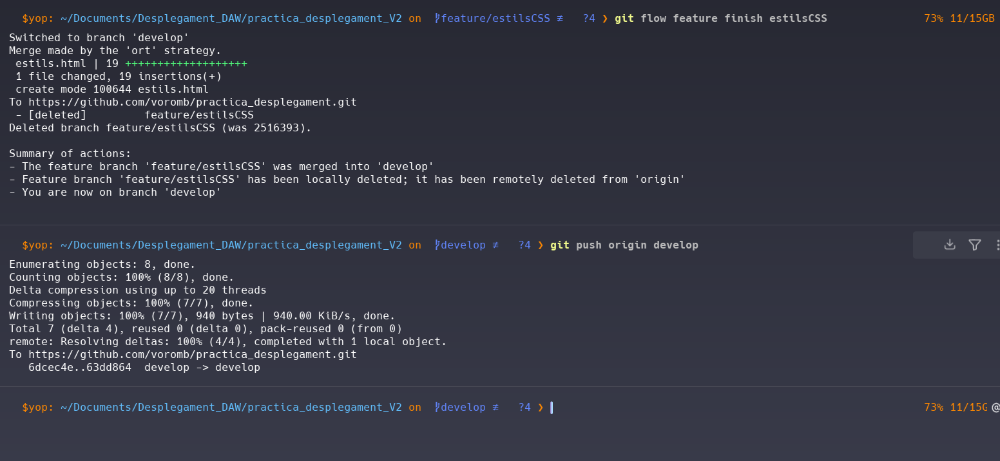

### 1️⃣6️⃣ Finalitzar release amb tag
```bash
git flow release finish v1.0
```
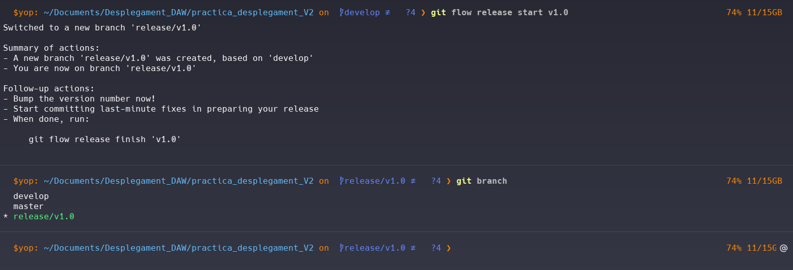

### 1️⃣7️⃣ Iniciar hotfix
```bash
git flow hotfix start milloresV_1_0
```
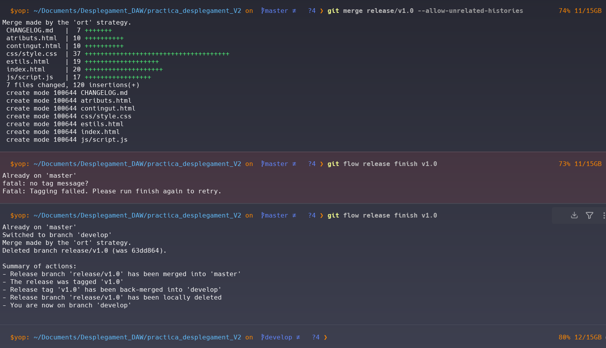

### 1️⃣8️⃣ Commit del hotfix
```bash
git commit -m "fix(milloresV_1_0): ajustar text de la secció contingut HTML"
```
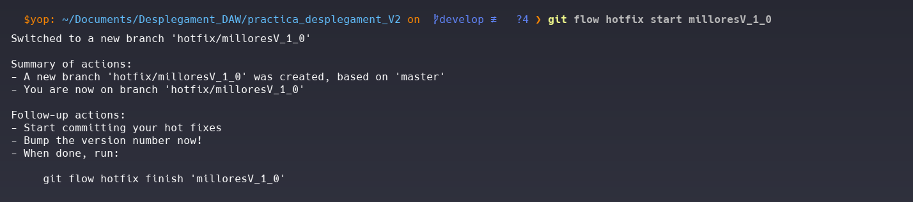

### 1️⃣9️⃣ Finalitzar hotfix
```bash
git flow hotfix finish milloresV_1_0
```


### 2️⃣0️⃣ Push final de branques i tags
```bash
git push origin master --tags
git push origin develop
```
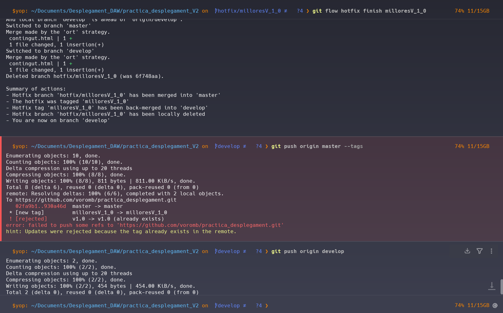

---

## 🎯 Conclusió
Aquest projecte s'ha gestionat aplicant la metodologia Git Flow amb una separació de rols simulant un equip real. S'han completat totes les fases requerides pel client: features, release i hotfix, amb una documentació final publicada amb GitHub Pages.

---

## 🌐 Publicació amb GitHub Pages
1. Obrir **Settings → Pages**
2. Seleccionar **Branch: gh-pages**
3. Guardar canvis ✅

> URL esperada: `https://voromb.github.io/practica_desplegament/`
