# Práctica 1 - Sistemas de Control de Versiones

**Estructura de ramas en Git Flow:**

- **main (master)**: Rama principal con código en producción
- **develop**: Rama de desarrollo con las últimas características
- **feature/***: Ramas para nuevas funcionalidades
- **release/***: Ramas paraA preparar nuevas versiones
- **hotfix/***: Ramas para correcciones urgentes en producción


## 2. Desarrollo del Proyecto

### 2.1 Configuración Inicial del Repositorio

#### Creación del repositorio en GitHub

**Usuario 1** (el más experimentado) se encarga de crear el repositorio:

```bash
# Clonamos el repositorio creado en GitHub
git clone https://github.com/voromb/practica_desplegament.git

# Entramos en el directorio del proyecto
cd practica_desplegament
```

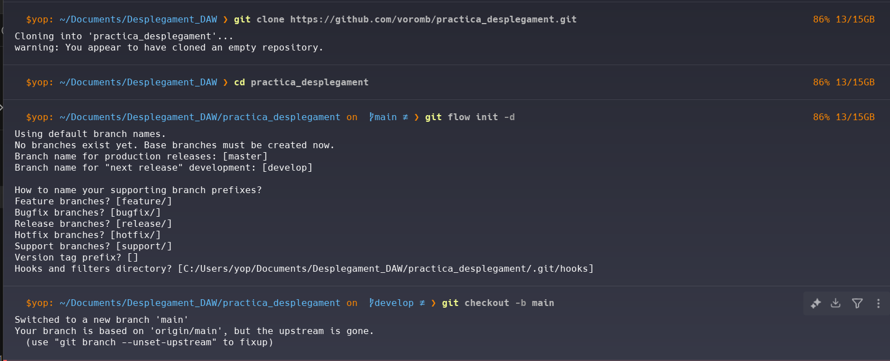

#### Creación de las ramas principales para Git Flow

```bash
# Creamos la rama main (si no existe)
git checkout -b main

# Creamos la rama develop
git checkout -b develop

# Subimos la rama main al remoto
git push -u origin main

# Subimos la rama develop al remoto
git push -u origin develop
```

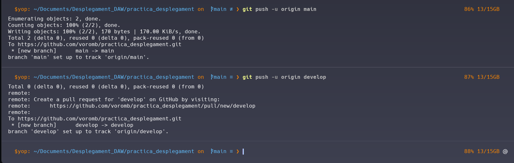
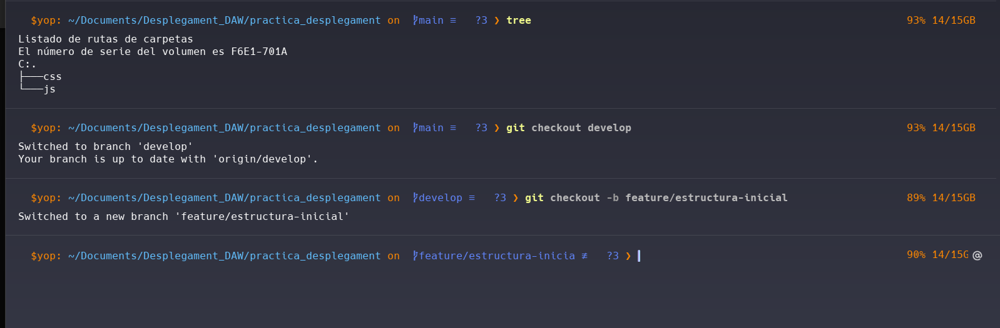
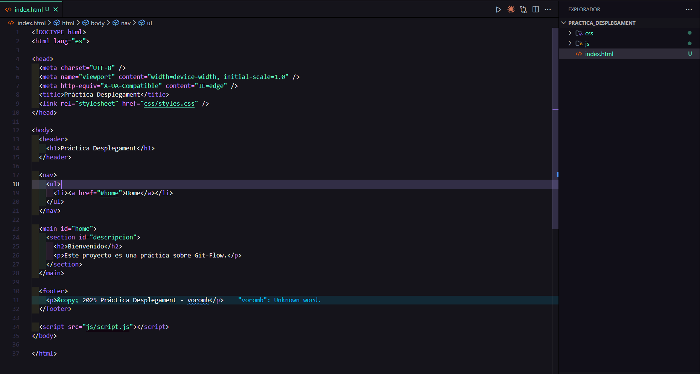

### 2.2 Implementación de la Estructura Inicial (Usuario 1)

#### Creación de la feature para la estructura inicial

```bash
# Nos situamos en develop
git checkout develop

# Creamos la feature branch
git checkout -b feature/estructura-inicial

# Creamos la estructura de archivos
mkdir css js
touch index.html css/styles.css js/script.js

# Añadimos el contenido inicial al index.html
echo "<!DOCTYPE html>
<html lang='es'>
<head>
    <meta charset='UTF-8'>
    <title>Curso JavaScript - Interacciones HTML</title>
    <link rel='stylesheet' href='css/styles.css'>
</head>
<body>
    <header>
        <h1>Curso JavaScript aplicado a HTML</h1>
    </header>
    <nav>
        <ul>
            <li><a href='#home'>Home</a></li>
            <li><a href='#modificar-html'>Modificar contenido HTML</a></li>
            <li><a href='#modificar-atributos'>Modificar atributos HTML</a></li>
            <li><a href='#modificar-css'>Modificar estilos CSS</a></li>
        </ul>
    </nav>
    <main>
        <section id='home'>
            <h2>Bienvenido al curso</h2>
            <p>Descripción del curso de JavaScript</p>
        </section>
    </main>
    <footer>
        <p>© 2024 Curso JavaScript</p>
    </footer>
    <script src='js/script.js'></script>
</body>
</html>" > index.html
```

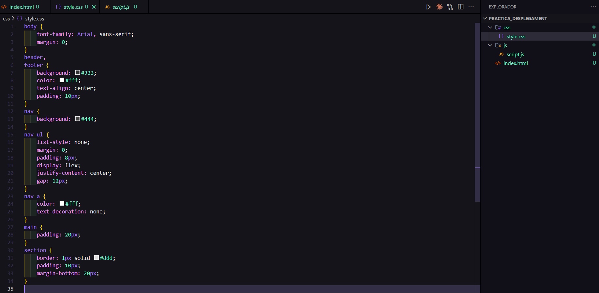
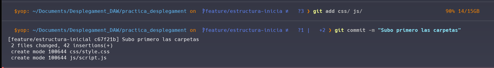

#### Commits de la estructura inicial

```bash
# Primer commit: Creación de estructura
git add .
git commit -m "feat(usuario1): crear estructura inicial del proyecto

- Añadido index.html con estructura básica
- Creadas carpetas css y js
- Implementado header, nav y footer"

# Visualizamos el estado
git status
```

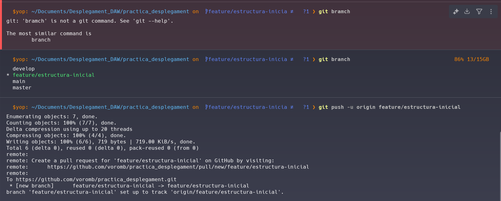

```bash
# Segundo commit: Mejoras en el HTML
# (Después de añadir más contenido al HTML)
git add index.html
git commit -m "feat(usuario1): añadir contenido completo al home

- Descripción detallada del curso
- Estructura de navegación mejorada
- Footer con información adicional"

# Push de la feature
git push -u origin feature/estructura-inicial
```

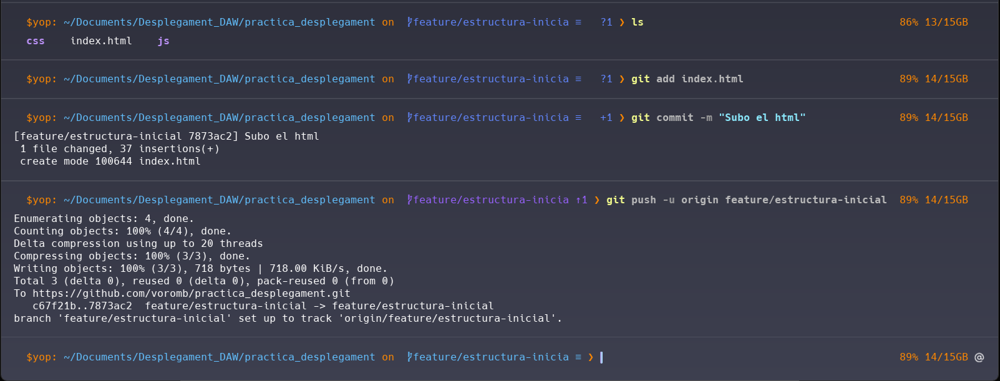
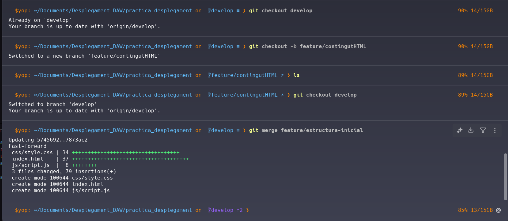

#### Merge de la feature a develop

```bash
# Creamos Pull Request en GitHub y mergeamos
# O localmente:
git checkout develop
git merge feature/estructura-inicial
git push origin develop
```

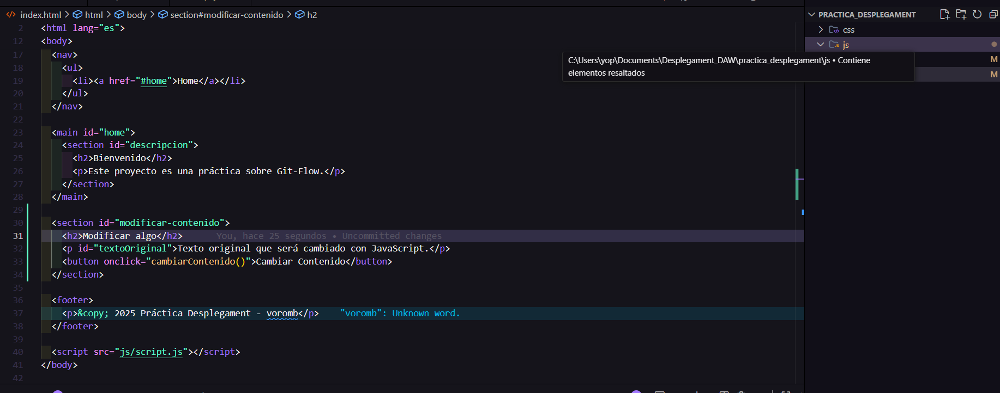

### 2.3 Implementación de Secciones HTML (Usuario 2)

#### Feature para Modificar Contenido HTML

```bash
# Simulamos el usuario 2
git checkout develop
git pull origin develop

# Creamos la primera feature
git checkout -b feature/contingutHTML

# Modificamos el index.html añadiendo la sección
# Añadimos código JavaScript para ejemplos
```

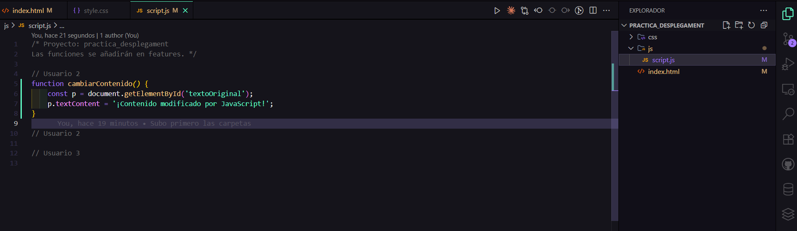

```bash
# Commit de los cambios
git add .
git commit -m "feat(usuario2): implementar sección modificar contenido HTML

- Añadidos ejemplos de manipulación DOM
- Código JavaScript documentado
- Explicaciones detalladas de cada ejemplo"

git push -u origin feature/contingutHTML
```

#### Feature para Modificar Atributos HTML

```bash
# Creamos la segunda feature del usuario 2
git checkout develop
git checkout -b feature/atributsHTML

# Implementamos la sección de atributos
```

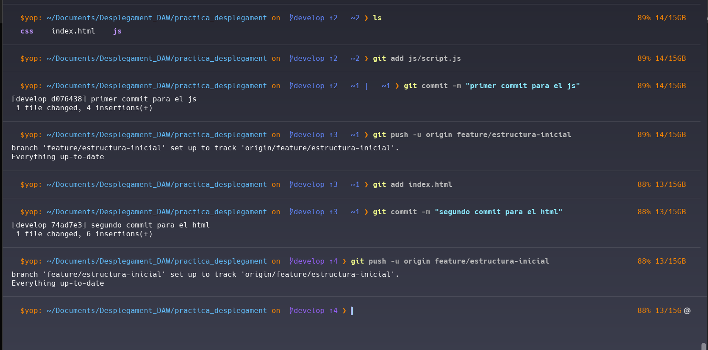

```bash
# Commit de los cambios
git add .
git commit -m "feat(usuario2): implementar sección modificar atributos HTML

- Ejemplos de setAttribute y getAttribute
- Manipulación de clases con classList
- Casos de uso prácticos"

git push -u origin feature/atributsHTML
```

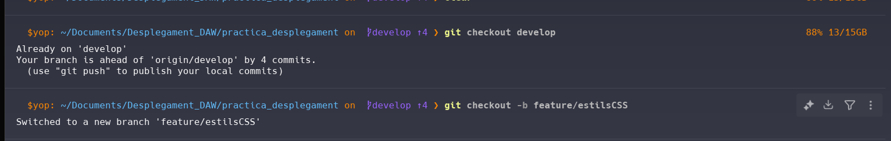

### 2.4 Implementación de Estilos CSS (Usuario 3)

#### Feature para Modificar Estilos CSS

```bash
# Simulamos el usuario 3
git checkout develop
git pull origin develop

# Creamos la feature
git checkout -b feature/estilsCSS
```

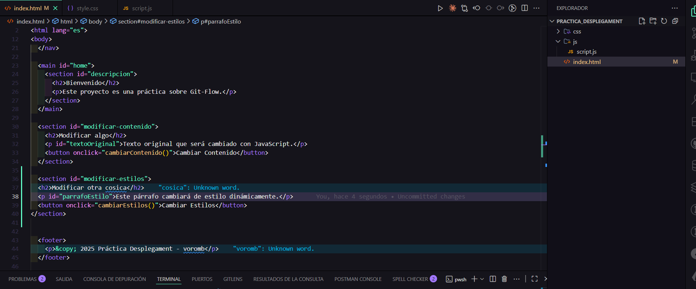

```bash
# Implementamos la sección de estilos CSS
# Añadimos ejemplos en JavaScript y CSS
```

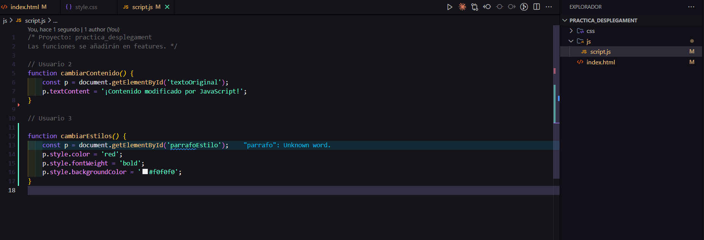
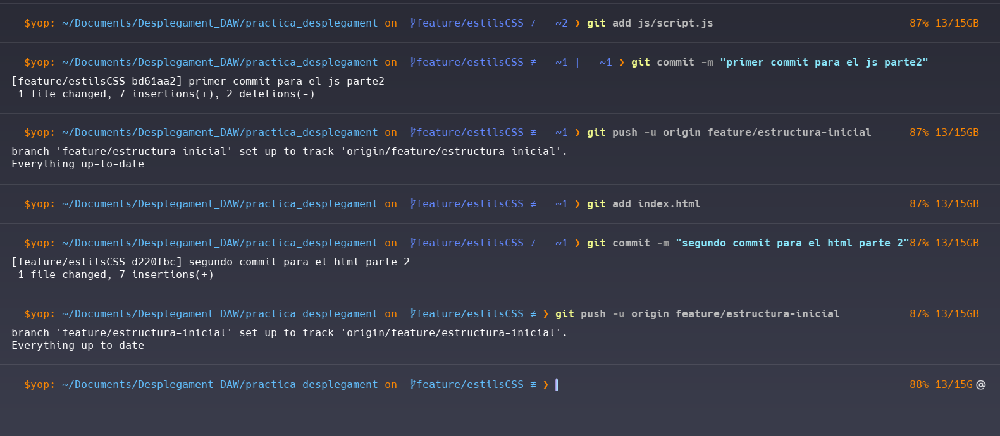

```bash
# Commit de los cambios
git add .
git commit -m "feat(usuario3): implementar sección modificar estilos CSS

- Ejemplos de manipulación de style
- Cambios dinámicos de CSS con JavaScript
- Animaciones y transiciones"

git push -u origin feature/estilsCSS
```

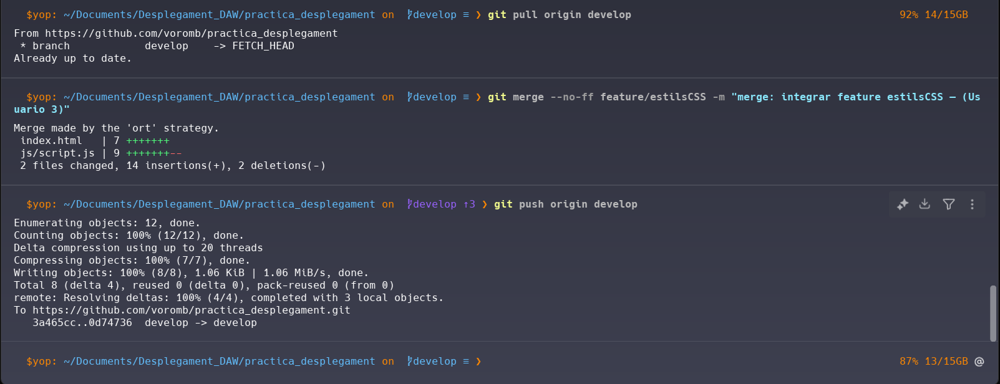

#### Merge de todas las features a develop

```bash
# Mergeamos todas las features pendientes
git checkout develop

# Merge de contingutHTML
git merge feature/contingutHTML

# Merge de atributsHTML  
git merge feature/atributsHTML

# Merge de estilsCSS
git merge feature/estilsCSS

git push origin develop
```

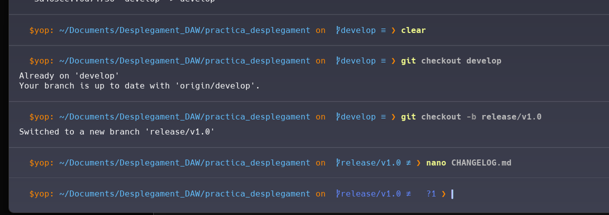

### 2.5 Creación de Release v1.0 (Usuario 3)

```bash
# Desde develop creamos la release
git checkout develop
git checkout -b release/v1.0

# Actualizamos versión en archivos si es necesario
echo "v1.0" > VERSION

git add VERSION
git commit -m "chore(usuario3): preparar release v1.0

- Versión estable con todas las secciones
- Lista para producción"

git push -u origin release/v1.0
```

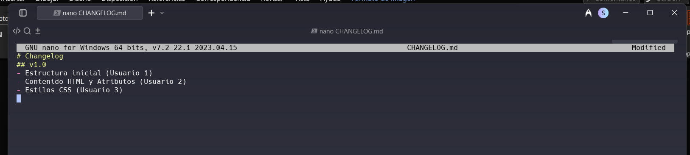
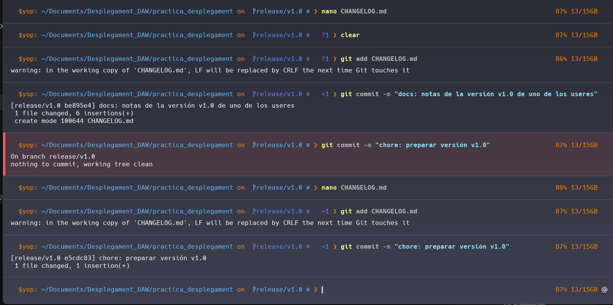

#### Merge de release a main y etiquetado

```bash
# Merge a main
git checkout main
git pull origin main
git merge release/v1.0
git push origin main

# Creamos el tag
git tag -a v1.0 -m "Versión 1.0 - Primera release estable"
git push origin v1.0
```

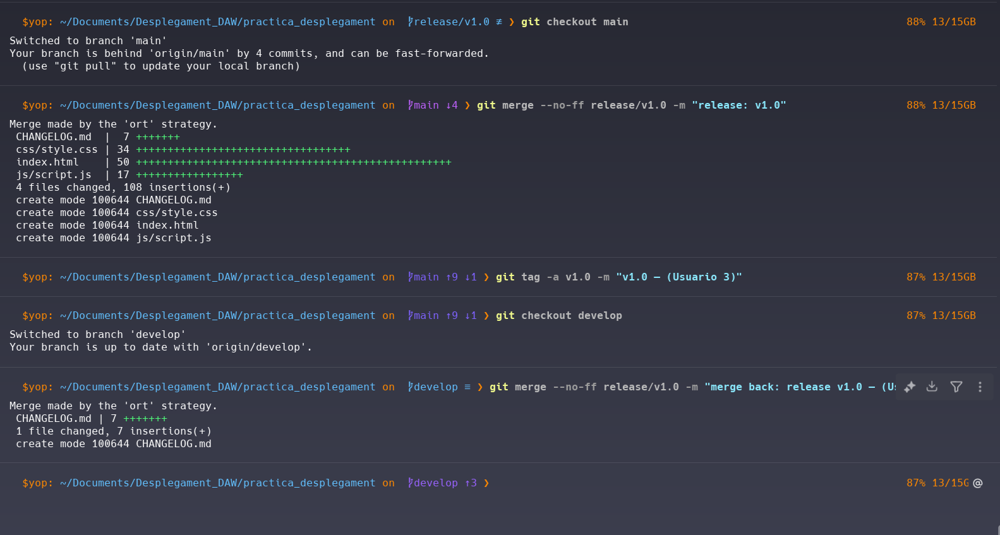
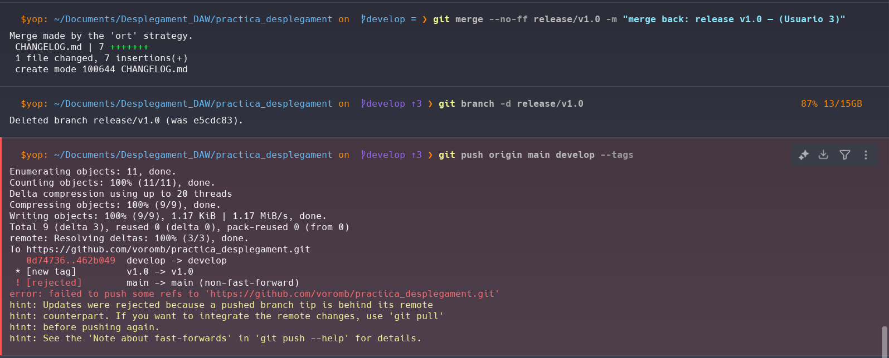

#### Back-merge a develop

```bash
# Sincronizamos develop con main
git checkout develop
git merge main
git push origin develop
```

**Resolución de conflictos encontrados:**

Durante el proceso encontramos que la rama local main estaba desactualizada:

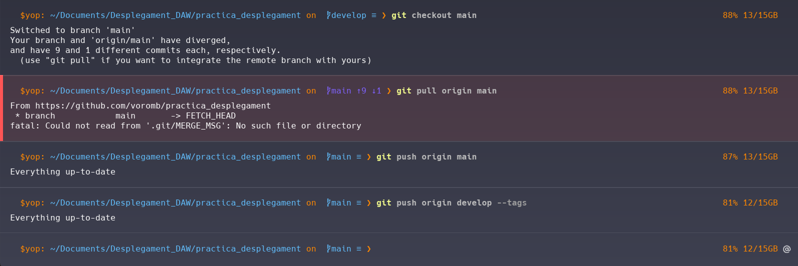

Solución aplicada:

```bash
# Cambiamos a main y actualizamos
git checkout main
git pull origin main

# Ahora podemos continuar con el push
git checkout develop
git push origin develop
```

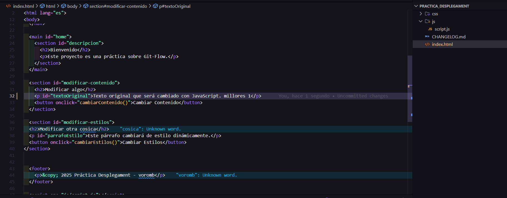

### 2.6 Implementación de Hotfix (Usuario 1)

#### Creación del hotfix desde main

```bash
# Desde main creamos el hotfix
git checkout main
git checkout -b hotfix/milloresV_1_0

# Realizamos mejoras en el HTML
# Mejoramos la sección creada por el usuario 2
```

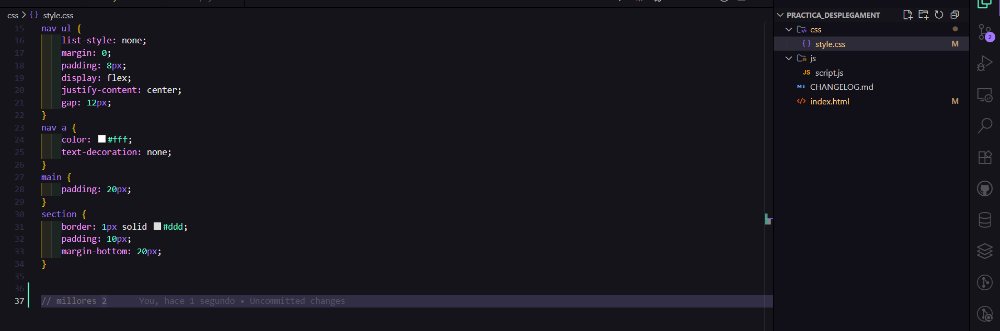

```bash
# También ajustamos estilos CSS
```

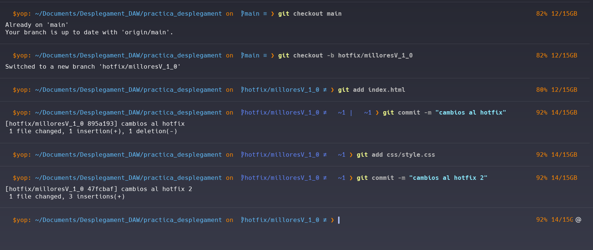

```bash
# Commit del hotfix
git add .
git commit -m "hotfix(usuario1): mejoras en la sección de contenido v1.0

- Mejorado el diseño de la sección de contenido HTML
- Ajustes de estilos para mejor visualización
- Corrección de pequeños bugs"

git push -u origin hotfix/milloresV_1_0
```

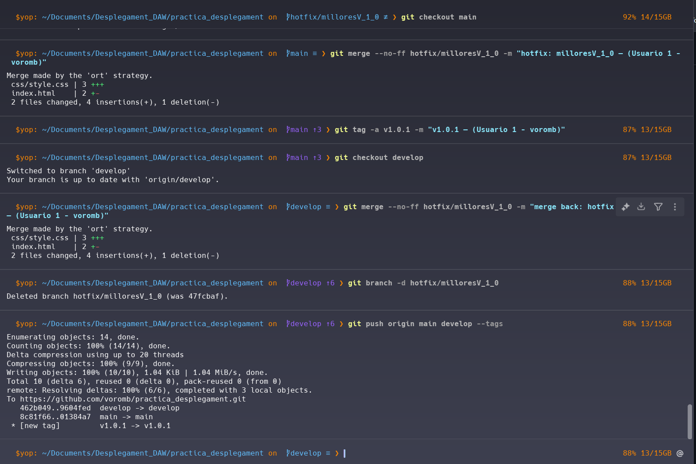

#### Merge del hotfix a main y develop

```bash
# Merge a main
git checkout main
git merge hotfix/milloresV_1_0
git push origin main

# Creamos nuevo tag
git tag -a v1.0.1 -m "Versión 1.0.1 - Hotfix con mejoras"
git push origin v1.0.1

# Back-merge a develop
git checkout develop
git merge main
git push origin develop

# Eliminamos la rama del hotfix
git branch -d hotfix/milloresV_1_0
git push origin --delete hotfix/milloresV_1_0
```

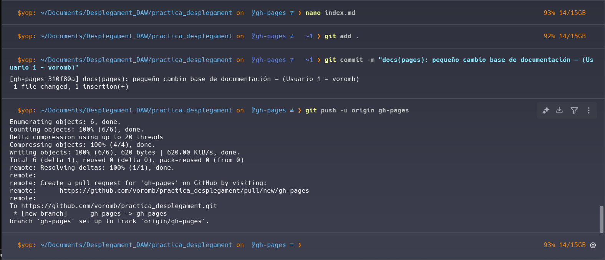

### 2.7 Configuración de GitHub Pages

Para publicar la documentación configuramos GitHub Pages:

```bash
# Creamos la rama gh-pages
git checkout -b gh-pages

# Añadimos este archivo de documentación
touch README.md
# (Copiamos todo este contenido al README.md)

git add README.md
git commit -m "docs: añadir documentación completa del proyecto"
git push -u origin gh-pages
```

**Configuración en GitHub:**
1. Ir a Settings → Pages
2. Source: Deploy from a branch
3. Branch: gh-pages
4. Folder: / (root)
5. Save

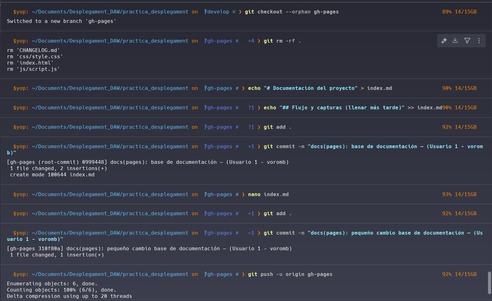

## 3. Resumen de Comandos Git Flow Utilizados

### Comandos principales utilizados:

```bash
# Inicialización
git clone [url]
git checkout -b [rama]

# Features
git checkout -b feature/[nombre]
git add .
git commit -m "feat([usuario]): [descripción]"
git push -u origin feature/[nombre]

# Releases
git checkout -b release/[version]
git merge [rama]
git tag -a v[version] -m "[mensaje]"

# Hotfixes
git checkout -b hotfix/[nombre]
git merge hotfix/[nombre]

# Sincronización
git pull origin [rama]
git push origin [rama]

# Merge
git merge [rama]

# Tags
git tag -a v[version] -m "[mensaje]"
git push origin v[version]
```
